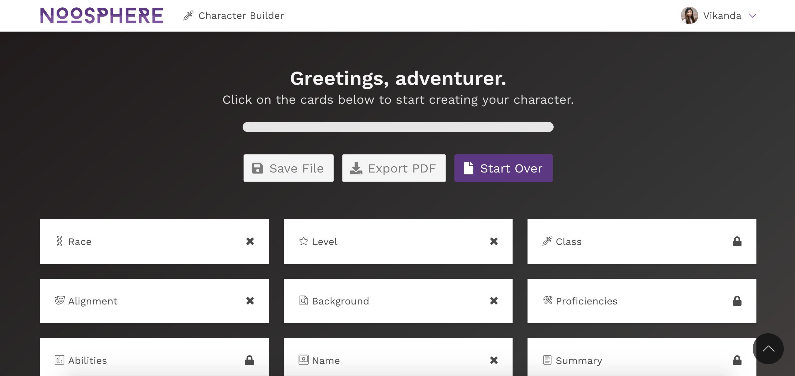
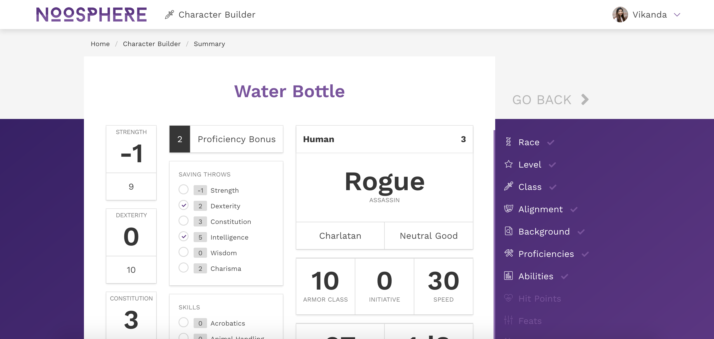

# Character Builder

>Currently a work in progress!

#### Why did I decide to do this?
- For those unfamiliar with D&D, starting it can be really intimidating! Have you seen how many books there are now?
- But even for experienced D&D players, making a character can be really time-consuming and involve a lot of prior research.

#### What is this exactly?
- This is an interactive D&D character builder that leads you through series of options to help customize your character for your next game.
- Preliminary choices, such as race, level, class will affect what other options are made available to you. Watch everything change as you go back and change your answers!
- Everything you have selected will then be calculated into stats in a final summary page, ready for you to take to your D&D game!

#### How did I build this?
- I built this with HTML5, CSS3, and Sass using the [Bulma](http://bulma.io) framework, along with JavaScript, jQuery, and PHP.

#### What's next?
- Still need to be able to roll for HP and integrate spells and feats
- Ability to export to PDF
- Ability to make an account and save characters
- There’s always more D&D data to add!

## Could I take a peek?

For now, you will need a local environment like xAMP (LAMP, MAMP, or WAMP) installed to view the character builder. When I'm done with the final version, I will be uploading it to a domain and host, which *will* support PHP.

For now, a current working version is available [here](http://vikanda.net/character-builder). Please open this on Firefox or some other browser that isn't Chrome. I am not sure why this is an issue, but I will be doing a complete JS overhaul to fix this in the future.

## Known Bugs

- JS doesn't quite load correctly on Google Chrome but is fine in all other browsers. This needs to be investigated.
- I'm on a mission to make this whole thing more data-driven, but I'll be doing a complete JS overhaul on another branch some other time.
- The level field is great but isn't foolproof. Currently, you are unable to click in front of an entered number to add another number, even if the resulting level is valid, due to the logic of the JS.
- There is a bug on the point-buy calculator where if you hold the up or down button, it is possible to go into a point deficit.
- Occasionally, when going back to change some options, the proficiencies section will bug out and show up as not complete despite all options being selected.
- Plurality of proficiencies will occasionally be inaccurate.

## Copyright

Copyright &copy; 2018 Vikanda Gonzales. Made with [Bulma](http://bulma.io). Dungeons & Dragons is owned by [Wizards of the Coast](http://dnd.wizards.com).
